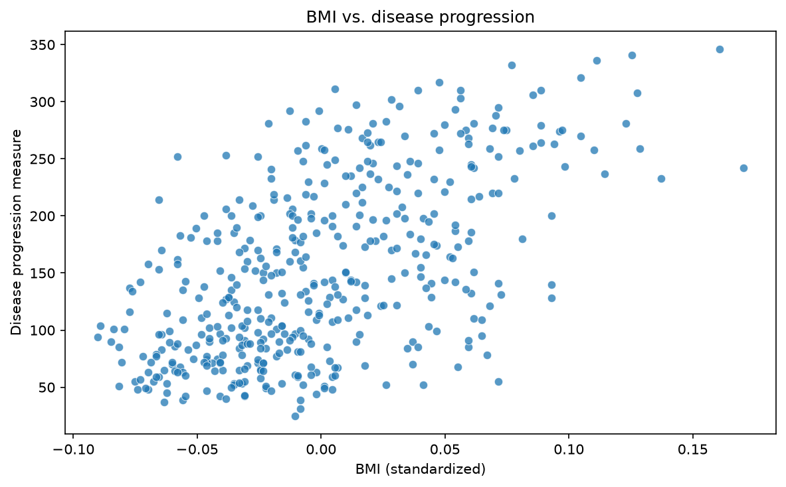
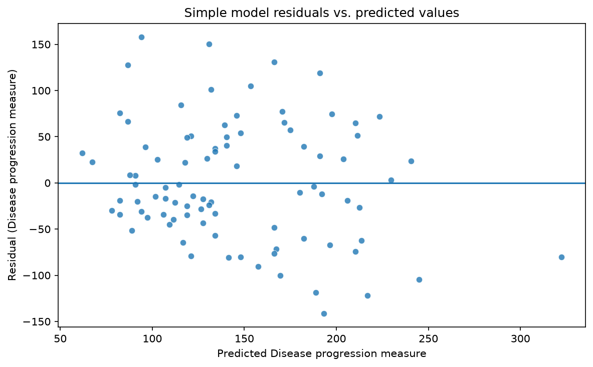
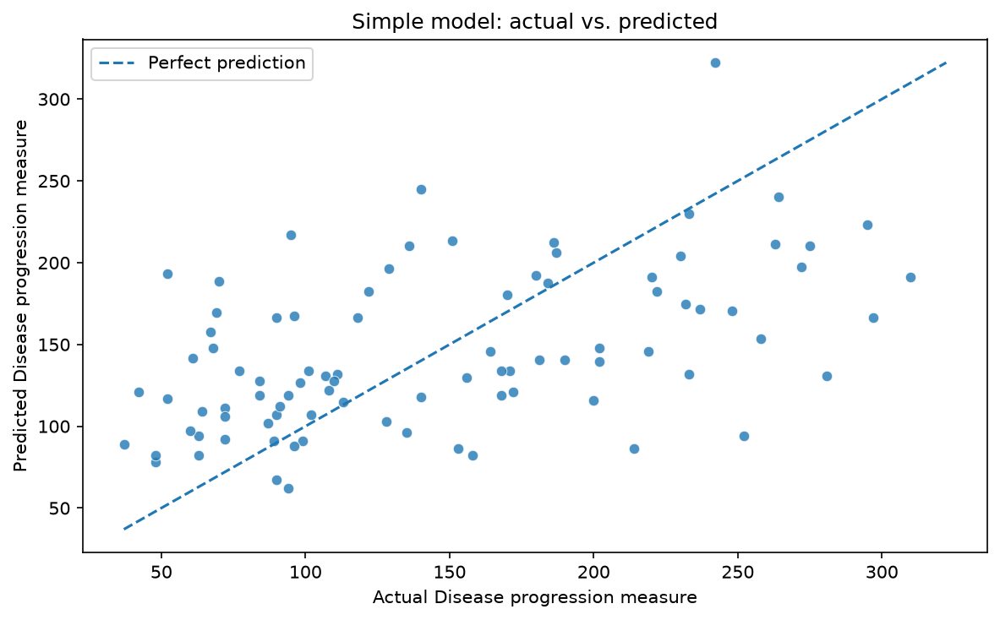
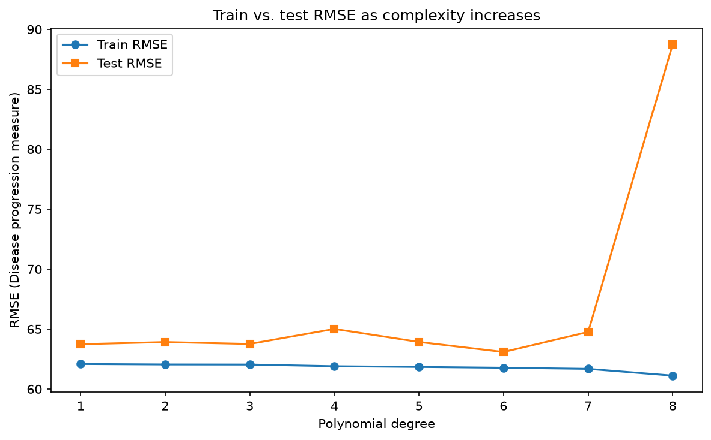
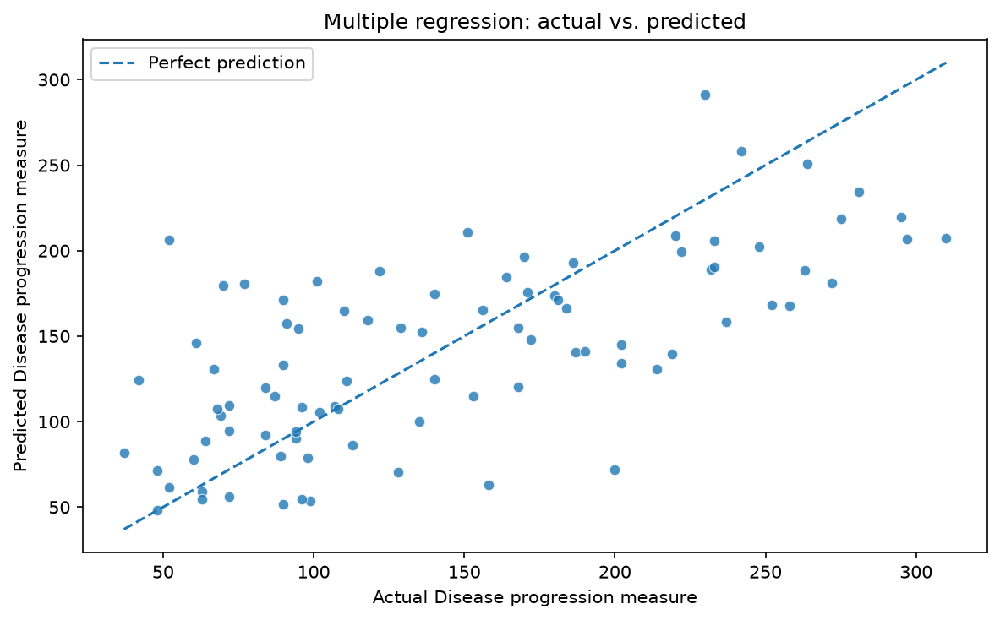
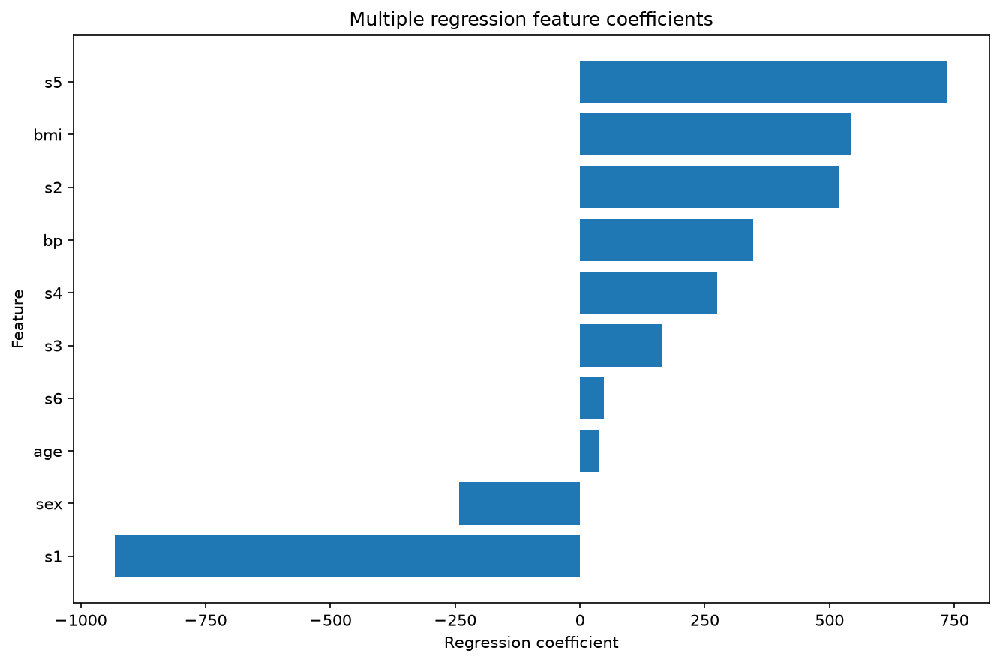

# Project Documentation

This site provides documentation for my regression project.

## How-To Guide

Many instructions are common to all our projects.

See the
[⭐ **Workflow: Apply Example**](https://denisecase.github.io/pro-analytics-02/workflow-b-apply-example-project/)
to learn how to copy, run, modify, document, and publish the example project.

## Project Documentation Pages

- **Home** - this documentation landing page
- [**Project Instructions**](./project-instructions.md) - the standard project workflow
- [**Your Files**](./your-files.md) - how to copy the example and create your own version
- [**Glossary**](./glossary.md) - project terms and concepts
- [**API**](./api.md) - autogenerated code documentation

## Phase 4. Technical Modification

For Phase 4, I made a small technical modification to the regression workflow.

### What I Changed

I added **mean absolute error (MAE)** as an additional evaluation metric.

The original example mainly used:

- R-squared
- RMSE
- residual plots

MAE provides another useful measurement because it reports the average absolute difference between the actual and predicted values without squaring the errors.

I also added an **actual-versus-predicted chart**. This chart makes it easier to compare the model predictions with the true values. Predictions closer to the diagonal reference line are more accurate.

The notebook was also updated to save its charts automatically in the `docs/images/` folder.

### Why I Chose This Change

I chose this modification because MAE is easy to interpret and provides another way to understand model error.

The actual-versus-predicted chart also provides clear visual evidence of how well the model performs.

### Verification

I verified the modification by:

- restarting the notebook kernel;
- running all notebook cells;
- confirming that MAE appeared with the other metrics;
- confirming that the charts were displayed;
- confirming that the image files were saved in `docs/images/`;
- confirming that the notebook completed successfully.

Compared with the original example, my version includes an additional evaluation metric and more visual evidence of model performance.

### Difficulty

I rated this modification as **moderate**.

Adding MAE was straightforward, but creating, saving, and verifying the charts required additional code and careful file-path handling.

## Phase 5. Custom Project

For Phase 5, I applied regression skills to a new problem using the Scikit-Learn diabetes regression dataset.

### Basis and Data

The original project example used the Seaborn Penguins dataset. It used `flipper_length_mm` as a feature to predict the numeric target `body_mass_g`.

For my custom project, I used Scikit-Learn's built-in diabetes regression dataset.

The dataset contains:

- 442 observations;
- 10 standardized numeric features;
- one numeric target.

I saved the dataset locally as:

`data/raw/diabetes_regression.csv`

I chose this dataset because it allowed me to apply regression to a different domain and compare a simple one-feature model with a multiple regression model.

An important limitation is that this is an educational dataset. The results should not be interpreted as medical advice or used for clinical decisions.

### Modeling Approach

This is a **supervised machine learning** problem because each observation includes a known target value.

It is a **regression problem** because the target is continuous and numeric rather than a category.

I created two models:

1. A simple linear regression model using only `bmi`.
2. A multiple linear regression model using all ten available features.

The data was divided into training and testing sets.

The models were trained using the training data and evaluated using the held-out testing data.

### Target

The target in the original Penguins example was:

`body_mass_g`

The target in my custom project is:

`disease_progression`

The target represents a quantitative measure of diabetes disease progression one year after baseline.

Because the target is numeric, the project remains a regression problem.

The models were evaluated using:

- R-squared;
- MAE;
- RMSE;
- residual plots;
- actual-versus-predicted charts.

### Features

The original example used one feature:

`flipper_length_mm`

My simple regression model used:

`bmi`

My multiple regression model used all ten available features:

- `age`
- `sex`
- `bmi`
- `bp`
- `s1`
- `s2`
- `s3`
- `s4`
- `s5`
- `s6`

The BMI-only model served as a simple baseline.

The multiple regression model was used to determine whether adding more features improved prediction performance.

### Evaluation and Results

I evaluated the models using:

- R-squared;
- mean absolute error;
- root mean squared error;
- residual plots;
- actual-versus-predicted plots;
- train-versus-test RMSE.

#### BMI-Only Model

The BMI-only simple linear regression produced:

- R-squared: **0.233**
- MAE: **52.260**
- RMSE: **63.732**

The R-squared value means that BMI alone explained approximately 23.3% of the variation in the testing target.

The result showed that BMI contains useful information, but BMI alone does not explain enough of the target.

#### Polynomial Complexity

I compared polynomial degrees 1 through 8 using BMI as the feature.

Degree 6 produced the lowest testing RMSE, but its improvement over degree 1 was less than one target unit.

Degree 8 performed much worse on the testing data while the training error continued to decrease.

This showed overfitting. The more complex model fit the training data more closely but performed worse on unseen testing data.

Because the improvement was very small, the degree-1 model remained a reasonable choice when simplicity and interpretability were important.

#### Multiple Regression Model

The multiple regression model using all ten features produced:

- R-squared: **0.453**
- MAE: **42.794**
- RMSE: **53.853**

The multiple regression model performed better than the BMI-only model on every test metric.

The R-squared increased from `0.233` to `0.453`.

The MAE decreased from `52.260` to `42.794`.

The RMSE decreased from `63.732` to `53.853`.

These results show that BMI is informative, but the additional features provide useful predictive information.

### Summary

For this custom project, I used regression to predict a numeric measure of diabetes disease progression.

I first created a simple linear regression model using BMI.

I then created a multiple linear regression model using all ten available features.

The BMI-only model produced:

- R-squared: `0.233`
- MAE: `52.260`
- RMSE: `63.732`

The multiple regression model produced:

- R-squared: `0.453`
- MAE: `42.794`
- RMSE: `53.853`

The multiple regression model performed better because it explained more variation in the target and produced smaller prediction errors.

I also learned that increasing model complexity does not always improve testing performance.

The polynomial comparison showed that a more complex model can overfit the training data and perform worse on unseen data.

This project helped me practice:

- loading and preparing data;
- selecting features and a target;
- splitting data into training and testing sets;
- training simple and multiple regression models;
- calculating R-squared, MAE, and RMSE;
- interpreting residuals;
- identifying overfitting;
- creating and saving charts;
- documenting model results.

These skills could also be applied to predicting:

- prices;
- passenger traffic;
- sales;
- demand;
- energy use;
- flight delays;
- other continuous numeric outcomes.

### Limitations and Next Steps

The multiple regression model performed better than the simple model, but an R-squared of `0.453` means that a large amount of variation remains unexplained.

The results are useful for learning regression, but they are not accurate enough for clinical use.

Future improvements could include:

- comparing Ridge and Lasso regression;
- using cross-validation;
- testing nonlinear models;
- comparing different train-test splits;
- examining coefficient stability;
- testing tree-based regression models;
- evaluating fairness and subgroup performance.
